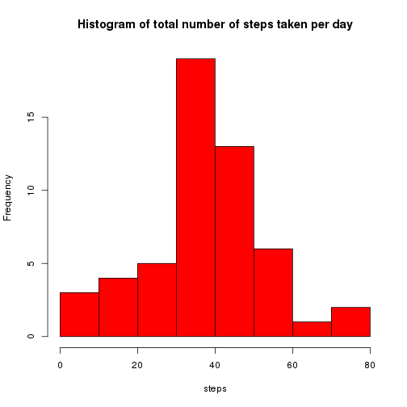
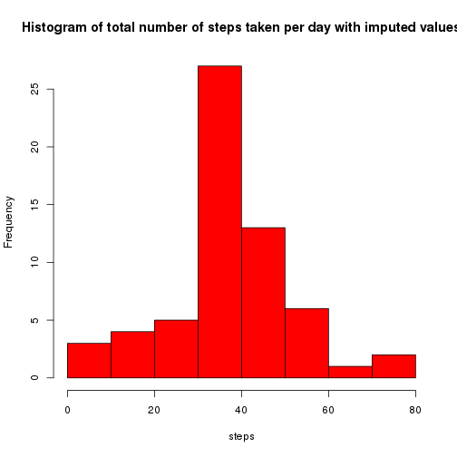
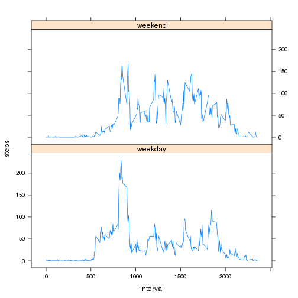

# Reproducible Research: Peer Assessment 1


## Loading and preprocessing the data

With the next chunk the data is loaded and preprocessed to obtain:
- steps per day
- steps per interval


```r
activity <- read.csv(unz("activity.zip", "activity.csv"), stringsAsFactors = FALSE)

# steps_per_day
steps_per_day <- as.data.frame(with(activity, tapply(steps, date, mean, na.rm = TRUE)))
colnames(steps_per_day) <- "steps"
steps_per_day$day <- rownames(steps_per_day)
rownames(steps_per_day) <- NULL

# steps_per_interval
steps_per_interval <- as.data.frame(with(activity, tapply(steps, interval, mean, 
    na.rm = TRUE)))
colnames(steps_per_interval) <- "steps"
steps_per_interval$interval <- rownames(steps_per_interval)
rownames(steps_per_interval) <- NULL
```


## What is mean total number of steps taken per day?

**Mean** total number of steps taken per day is **37.3826** and **median** total number of steps taken per day is **37.3785**.


```r
hist(steps_per_day$steps, main = "Histogram of total number of steps taken per day", 
    xlab = "steps", col = "red")
```

 


## What is the average daily activity pattern?
Time series plot of the 5-minute interval and the average number of steps taken, averaged across all days:


```r
plot(steps ~ interval, data = steps_per_interval, type = "l")
```

 


To find 5-minute interval, which on average across all the days in the dataset, contains maximum number of steps, the chunk of code is executed:

```r
steps_per_interval[which.max(steps_per_interval$steps), ]
```

```
##     steps interval
## 104 206.2      835
```


## Imputing missing values
To calculate the total number of missing values in the dataset we can use the chunk code below:


```r
table(is.na(activity))
```

```
## 
## FALSE  TRUE 
## 50400  2304
```


or use summary function:

```r
summary(activity)
```

```
##      steps           date              interval   
##  Min.   :  0.0   Length:17568       Min.   :   0  
##  1st Qu.:  0.0   Class :character   1st Qu.: 589  
##  Median :  0.0   Mode  :character   Median :1178  
##  Mean   : 37.4                      Mean   :1178  
##  3rd Qu.: 12.0                      3rd Qu.:1766  
##  Max.   :806.0                      Max.   :2355  
##  NA's   :2304
```


The total number of missing values is **2304**.

To fill the missing values in the dataset the mean for that 5-minute interval is used:


```r
na_values <- activity[is.na(activity$steps), ]
na_values$steps <- NULL
filled_values <- merge(na_values, steps_per_interval)
```


New dataset that is equal to the original dataset but with the missing data filled in:

```r
activity_filled <- rbind(filled_values, activity[!is.na(activity$steps), ])
activity_filled <- activity_filled[order(activity_filled$date, activity_filled$interval), 
    ]
```


Histogram of the total number of steps taken each day and Calculate and report the mean and median total number of steps taken per day. Do these values differ from the estimates from the first part of the assignment? What is the impact of imputing missing data on the estimates of the total daily number of steps?


```r
# steps_per_day
steps_per_day_imputed <- as.data.frame(with(activity_filled, tapply(steps, date, 
    mean, na.rm = TRUE)))
colnames(steps_per_day_imputed) <- "steps"
steps_per_day_imputed$day <- rownames(steps_per_day_imputed)
rownames(steps_per_day_imputed) <- NULL
```


**Mean** total number of steps taken per day is **37.3826** and **median** total number of steps taken per day is **37.3785**.


```r
hist(steps_per_day_imputed$steps, main = "Histogram of total number of steps taken per day with imputed values", 
    xlab = "steps", col = "red")
```

 


## Are there differences in activity patterns between weekdays and weekends?
Panel plot containing a time series plot (i.e. type = "l") of the 5-minute interval (x-axis) and the average number of steps taken, averaged across all weekday days or weekend days (y-axis):

```r
daytype <- function(wday) {
    if (wday %in% c("Sunday", "Saturday")) {
        return("weekend")
    }
    return("weekday")
}
activity_filled$wday <- weekdays(as.Date((activity_filled$date)))
activity_filled$daytype <- sapply(activity_filled$wday, daytype)

activity_filled$daytype <- as.factor(activity_filled$daytype)

per_daytype <- aggregate(steps ~ interval + daytype, data = activity_filled, 
    FUN = mean)

library(lattice)
xyplot(steps ~ interval | daytype, data = per_daytype, type = "l", layout = c(1, 
    2))
```

 

